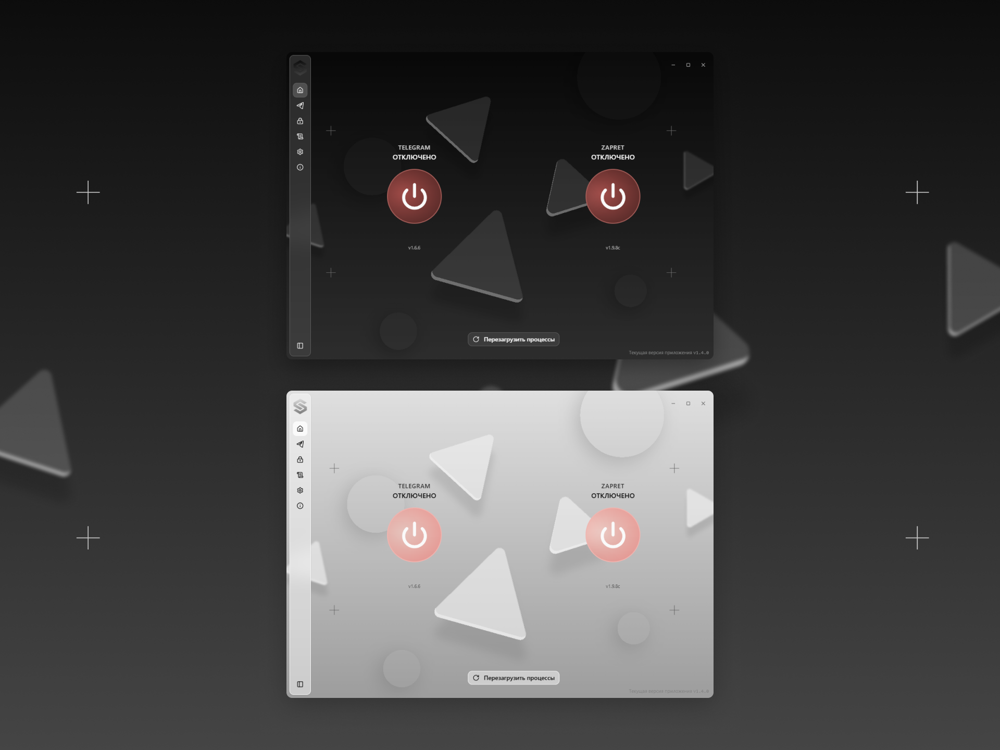

<p align="center">
  
</p>

<h1 align="center">Slipgate</h1>

<p align="center">
  Лёгкое Windows-приложение, объединяющее локальный
  <strong>Telegram WS-прокси</strong> и движок обхода DPI <strong>Zapret</strong>
  в одном удобном интерфейсе с трей-иконкой.
</p>

<p align="center">
  <a href="./LICENSE"></a>
  
  
  
</p>

---

## Что это

Slipgate управляет жизненным циклом двух сетевых сервисов из одного UI:

| Сервис                 | Назначение                                                                                                                                                                                                                                              |
| ---------------------- | ------------------------------------------------------------------------------------------------------------------------------------------------------------------------------------------------------------------------------------------------------- |
| **Telegram WS-прокси** | Локальный MTProto-over-WebSocket релей, чтобы Telegram Desktop (и форки: AyuGram, 64Gram, Forkgram, Nekogram, Kotatogram, Unigram) продолжал работать в ограниченных сетях. Кнопка «Открыть в Telegram» доставляет ссылку прокси прямо в запущенный TG. |
| **Zapret (обход DPI)** | Оборачивает `winws.exe` + `WinDivert`, поставляется с подобранным набором стратегий для разблокировки Discord, YouTube и общего обхода DPI. Активная стратегия выбирается в UI и сохраняется между перезапусками.                                       |

Оба сервиса автоматически перезапускаются при падении, могут запускаться
вместе с Windows (через scheduled task с правами администратора) и
показывают актуальный статус в трее и в самой программе.

## Возможности

- **Одна зелёная кнопка** — единый главный тогл на главной странице,
  единый визуальный язык во всём приложении.
- **Авто-обновление** — проверяет GitHub на новые релизы TgWsProxy и
  Zapret, устанавливает в один клик, кэширует ответ на диск, чтобы
  плашка обновления появлялась мгновенно при следующем запуске.
- **Дружелюбный к трею** — сворачивается в системный трей; опция
  `hideTaskbarIcon` полностью прячет иконку с панели задач, оставляя
  только трей.
- **Уникальные ключи на каждой установке** — при первом запуске после
  установки генерируется случайный секрет и ссылка Telegram-WS; две
  установки никогда не делят один ключ.
- **Портативный режим** — положи рядом с `.exe` файл-маркер `PORTABLE`,
  и приложение будет использовать локальную папку `data/` вместо
  `%APPDATA%`.
- **Многоязычный UI** — русский и английский; переключается в реальном
  времени.

## Скриншоты

<p align="center">
  
</p>

## Технологический стек

- **Electron 37** main-процесс (TypeScript, `vite-plugin-electron`)
- **React 19 + Vite + Tailwind CSS v4** в renderer
- **shadcn/ui + Radix UI + Lucide** для компонентов и иконок
- **Zustand** для state в renderer, типизированный IPC-мост main↔renderer
- **electron-builder + NSIS** инсталлятор (perMachine, с правами админа)
- **PyInstaller** для пересборки headless TgWsProxy CLI

## Быстрый старт (разработка)

```bash
pnpm install
pnpm dev          # или: dev.bat
```

В dev-режиме используется отдельная папка `%APPDATA%\slipgate-dev`,
поэтому эксперименты не затрагивают продакшн-конфиг в
`%APPDATA%\slipgate`.

## Сборка

```bash
pnpm build:win    # или: build.bat   (из админ-консоли Windows)
```

Что получится:

| Файл                            | Назначение                                        |
| ------------------------------- | ------------------------------------------------- |
| `dist\Slipgate_x64.exe`         | NSIS-инсталлятор (perMachine, требует админ-прав) |
| `dist\Slipgate_x64-portable.7z` | Портативный архив (распакуй и запускай)           |
| `dist\win-unpacked\`            | Распакованный вариант установки                   |

В каждую сборку «зашивается» свежий `BUILD_ID`, поэтому при первом
запуске на машине пользователя генерируется новый случайный
Telegram-WS секрет.

## Структура проекта

```
src/main/         Electron main-процесс (TS): конфиг, IPC, трей, autorun,
                  жизненный цикл Telegram-WS, жизненный цикл Zapret,
                  авто-обновление, NSIS hooks.
src/renderer/     React UI (страницы, компоненты, store, hooks, IPC).
src/shared/       Типы, общие для main и renderer.
build/            Ресурсы electron-builder (icon.ico, NSIS hooks).
resources/        Runtime-ассеты: стратегии Zapret, TgWsProxy_windows.exe,
                  winws.exe, WinDivert, иконки трея.
scripts/          Скрипты сборки (рендеринг иконок, патчинг Zapret,
                  пересборка tgws CLI, запуск VS).
docs/             Скриншоты и превью для README.
```

## Лицензия

Slipgate распространяется под лицензией **GNU General Public License
v3.0** — полный текст в [LICENSE](./LICENSE), краткое уведомление об
авторстве — в [COPYRIGHT](./COPYRIGHT).

Выбор GPL-3.0 не свободен — он обусловлен лицензиями исходных проектов,
от которых наследуется Slipgate (см. ниже).

## Авторство и сторонние компоненты

Slipgate стоит на плечах нескольких open-source проектов. Полный
перечень с копирайтами и условиями каждой лицензии — в файле
**[THIRD-PARTY-NOTICES.md](./THIRD-PARTY-NOTICES.md)**. Ключевые
заимствования:

- **[Koala Clash](https://github.com/coolcoala/koala-clash)** —
  архитектура UI, анимации переходов, ряд React-компонентов, токены
  Tailwind-темы и набор визуальных примитивов. _GPL-3.0._
- **[Flowseal/tg-ws-proxy](https://github.com/Flowseal/tg-ws-proxy)** —
  Telegram MTProto-over-WebSocket релей; поставляется как headless
  CLI-пересборка через зеркало
  [xdxdxdestra-svg/slipgate-tgws-cli](https://github.com/xdxdxdestra-svg/slipgate-tgws-cli).
  _GPL-3.0._
- **[Flowseal/zapret-discord-youtube](https://github.com/Flowseal/zapret-discord-youtube)**
  — набор стратегий обхода DPI; используется без изменений плюс
  build-time патчи Slipgate. _GPL-3.0._
- **[bol-van/zapret](https://github.com/bol-van/zapret)** — движок
  `winws.exe`, на котором держатся все стратегии. _В основном
  MIT-style; см. LICENSE.txt в исходниках._
- **[WinDivert](https://reqrypt.org/windivert.html)** — драйвер
  перехвата сетевых пакетов в Windows. _LGPL-3.0 с linker-исключением._
- **[Mihomo Party / Sparkle community fork](https://github.com/mihomo-party-org/mihomo-party)**
  — исторический предок; от него остались разве что общая структура
  репозитория и часть build-side соглашений, оригинального кода в
  Slipgate уже нет. _GPL-3.0._

Если ты нашёл проект, который стоило бы упомянуть, но его здесь нет —
открой issue.

## Вклад в проект

PR'ы приветствуются. Отправляя код, ты соглашаешься, что он будет
распространяться под теми же условиями GPL-3.0, что и остальной
Slipgate.

Перед открытием PR проверь, что всё собирается:

```bash
pnpm typecheck    # tsc --noEmit для main + renderer
pnpm lint         # eslint
pnpm format       # prettier
```

## Авторы

Разработка и поддержка — **lazzy & cherry**.
